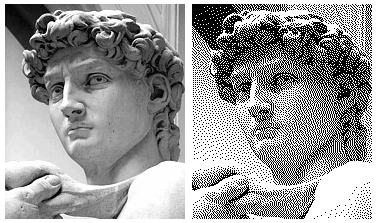
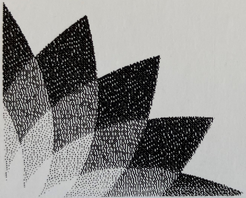
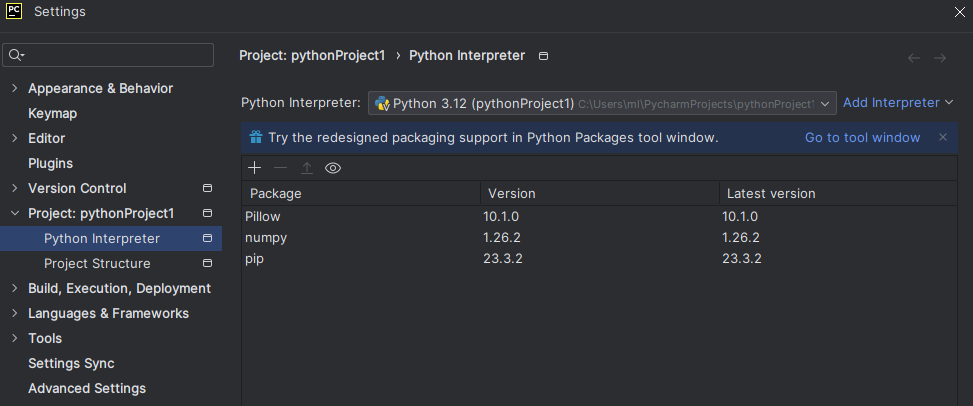

# zpl-grayscale-prep
prepares an image to import them into zpl

## preface
zpl does not offer a possibility to print in grayscale, this can only be reached by controlling the density of *black* pixels.  
for that, [Dither](https://en.wikipedia.org/wiki/Dither) is a method, especially the [Flyod-Steinberg algorithm](https://en.wikipedia.org/wiki/Floyd%E2%80%93Steinberg_dithering).  

import procedures on [Labelary Online ZPL Viewer](https://labelary.com/viewer.html) and [ZPL Designer](https://zpldesigner.com/) results in full black areas only commonly.  
with the preprocessing below, an only black pixeled image is created which can then be imported one to one. 

## examples (input - output)

## result printed out

## live usage
test and use it now directly on [Streamlit](https://zpl-grayscale-prep-v5xzgu2ddg8mqrgwrtazxq.streamlit.app/), runs 'fs-streamlit.py'

## zpl
add it to a zpl-code:
  - Labelary: Add image
  - ZPL Designer: Insert > Image

the section will be placed with the ^FO (Field Origin ) command automatically and can be adjusted

### resolution
the source image already has to have the right size:
|printer| 200 dpi | 300 dpi |
|-| --- | --- |
|1 mm| 8 px | 12 px |

## code
code base from [scipython](https://scipython.com/blog/floyd-steinberg-dithering/)
1. read in an image (grayscale or color)
2. convert it to grayscale
3. dither it to black and white only
4. save it as image-2

## setup on Windows
from scratch:
1. install [PyCharm Community Edition ](https://www.jetbrains.com/pycharm/download/?section=windows)
2. add the necessary [packages](packages.png) according to this [article](https://www.geeksforgeeks.org/how-to-install-numpy-in-pycharm/)

3. create a project
4. define folder and file in the code
5. run 'fs.py'

